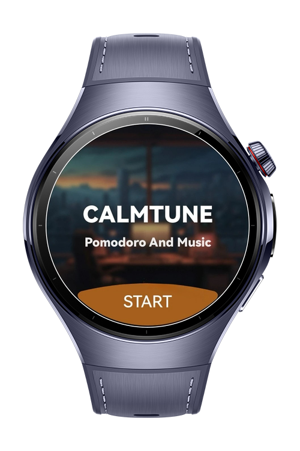
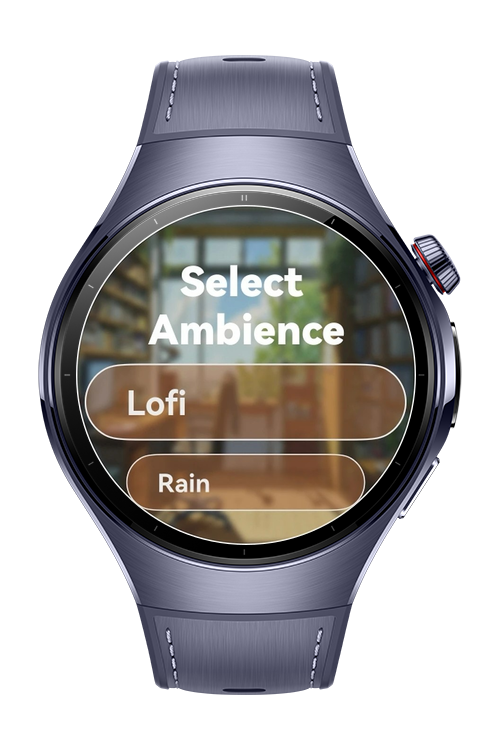
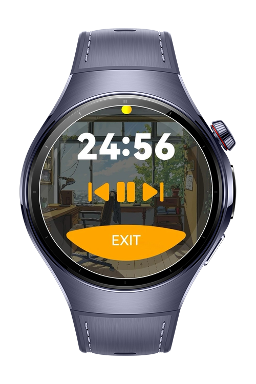
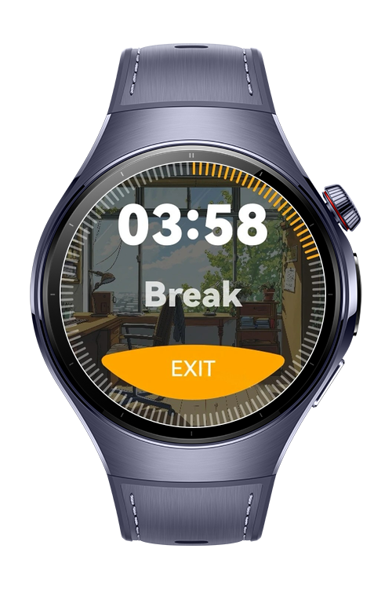

> **Note:** To access all shared projects, get information about environment setup, and view other guides, please visit [Explore-In-HMOS-Wearable Index](https://github.com/Explore-In-HMOS-Wearable/hmos-index).

# CalmTune


CalmTune is a HarmonyOS Next wearable app that combines the Pomodoro technique with relaxing ambience music.
Users can choose from different background sounds (like rain, lofi, or coffee shop) to stay focused during a 25-minute Pomodoro session. When the session ends, the app switches to a break page.

<br/>

# Preview

<div>
  
  
  
  
</div>

<br/>

# Use Cases

- Select an ambience (lofi, rain, coffee shop, fireplace, ocean waves, forest, white noise).

- Start a 25-minute Pomodoro session with the chosen ambience.

- Track remaining time with a progress bar during both focus and break sessions.

- Control playback: play, pause, skip, go back to different tracks.

- Enjoy themed background visuals (e.g., desk, workspace) to enhance focus.

- Automatically switch to a break page when the session ends.

<br/>

# Technology

## Stack
**Languages**: ArkTS

**Frameworks**: HarmonyOS SDK 5.1.0(18)

**Tools**: DevEco Studio Vers 5.1.0.842

**Libraries**: @kit.AVSessionKit, @kit.AbilityKit, @kit.BackgroundTasksKit, @kit.MediaKit, @kit.AudioKit, @kit.ImageKit

## Required Permissions

- `ohos.permission.KEEP_BACKGROUND_RUNNING`

<br/>

# Directory Structure
```
entry/src/main/ets/
├── model/
│   └── SongData.ets                # Data model for ambience songs
│
├── pages/
│   ├── AmbiencePage.ets            # List of ambience categories (lofi, rain, etc.)
│   ├── BreakPage.ets               # Break session page with timer & progress
│   ├── HomePage.ets                # Landing page / main menu
│   ├── Index.ets                   # Entry point page
│   └── MusicPage.ets               # Music playback screen with controls
│
├── services/
│   └── NavigationService.ets       # Handles navigation between pages
│
├── utils/
│   ├── AVSessionController.ets     # Controls AVSessionKit for media playback
│   ├── BackgroundUtil.ets          # Keeps app running in background
│   ├── MediaController.ets         # Core media control logic (play, pause, skip)
│   └── MediaTools.ets              # Helper functions for media handling
│
├── view/
│   ├── PlaybackView.ets            # UI component for playback progress
│   └── PlayPauseButton.ets         # Reusable play/pause button component
│
├── viewmodel/
│   ├── AMBIENCES.ets               # Static ambience definitions (rain, lofi, etc.)
│   ├── AmbienceViewModel.ets       # Handles ambience selection logic
│   ├── BaseViewModel.ets           # Base class for shared state
│   ├── DataModel.ets               # Data storage and state handling
│   ├── HomeViewModel.ets           # Logic for home page
│   └── MusicViewModel.ets          # Manages playback state & controls
│
├── entryability/
│   └── EntryAbility.ets            # App ability definition / startup
│
├── module.json5                    # App metadata, permissions
└── build-profile.json5             # Build, signing, and SDK info
```

<br/>

# Constraints and Restrictions

## Supported Device
- Huawei Watch 5

<br/>

# License

CalmTune is distributed under the terms of the MIT License.

See the [LICENSE](/LICENSE) for more information.